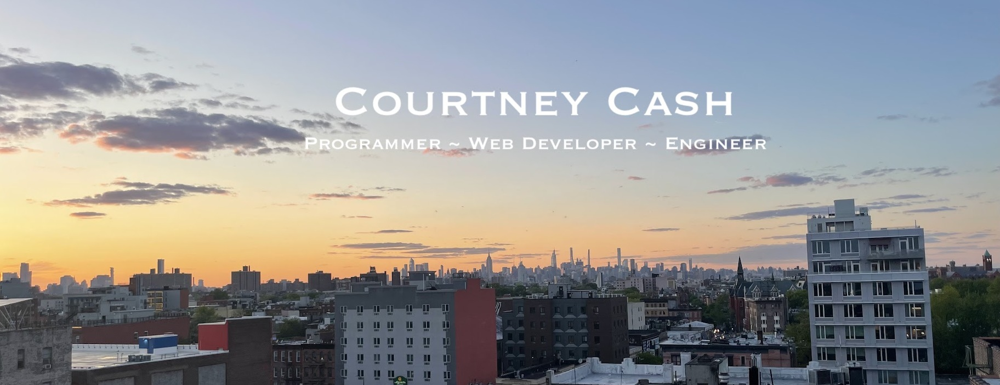

 ## 👋🏻 &nbsp;Hey there! I'm Courtney

### 👨🏻‍💻 &nbsp;About Me

💡 &nbsp;I like to explore new technologies and develop software solutions and quick hacks.\
🎓 &nbsp;I'm studied software engineering at The Flatiron School out of New York.\
🌱 &nbsp;I'm on track for learning more about data structures and algorithms.\
🌆 &nbsp; I just moved from New York to Seattle.\
🥏 &nbsp;In my free time, I play ultimate frisbee and enjoy exploring the outdoors.\
✉️ &nbsp;You can shoot me an email at cashcourtney97@gmail.com! I'll try to respond as soon as I can.

### 🛠 &nbsp;Tech Stack

&nbsp;
&nbsp;
&nbsp;
&nbsp;
\
&nbsp;
&nbsp;
&nbsp;
&nbsp;
&nbsp;
&nbsp;
&nbsp;

### ⚙️ &nbsp;GitHub Analytics

### 🤝🏻 &nbsp;Connect with Me

<!--
**ccash12/ccash12** is a ✨ _special_ ✨ repository because its `README.md` (this file) appears on your GitHub profile.

Here are some ideas to get you started:

- 🔭 I’m currently working on ...
- 🌱 I’m currently learning ...
- 👯 I’m looking to collaborate on ...
- 🤔 I’m looking for help with ...
- 💬 Ask me about ...
- 📫 How to reach me: ...
- 😄 Pronouns: ...
- ⚡ Fun fact: ...
-->
